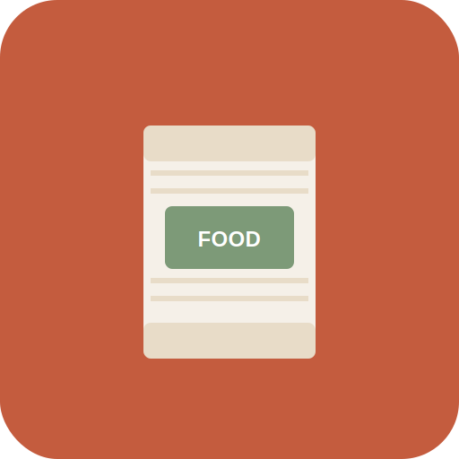
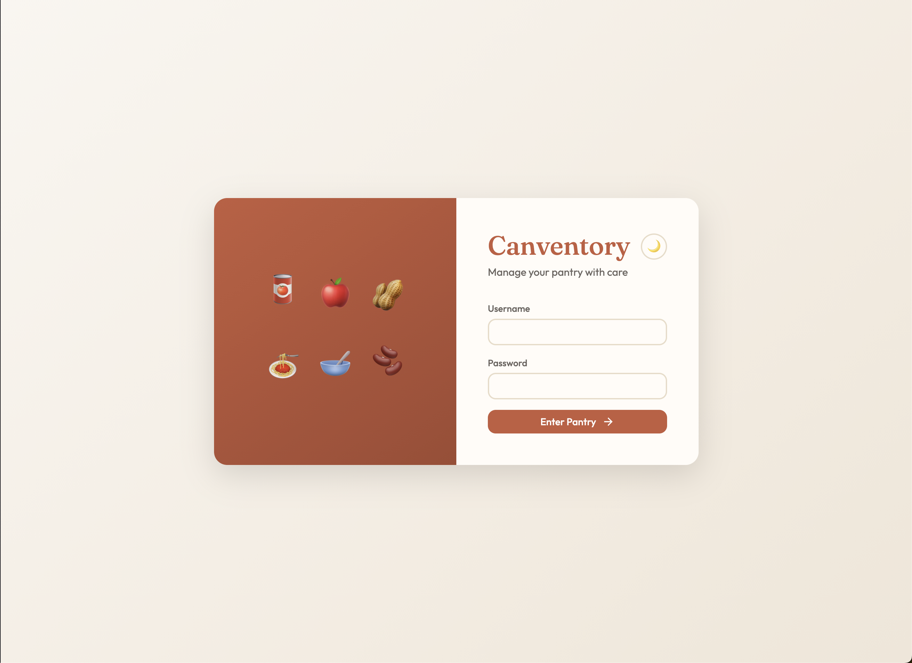
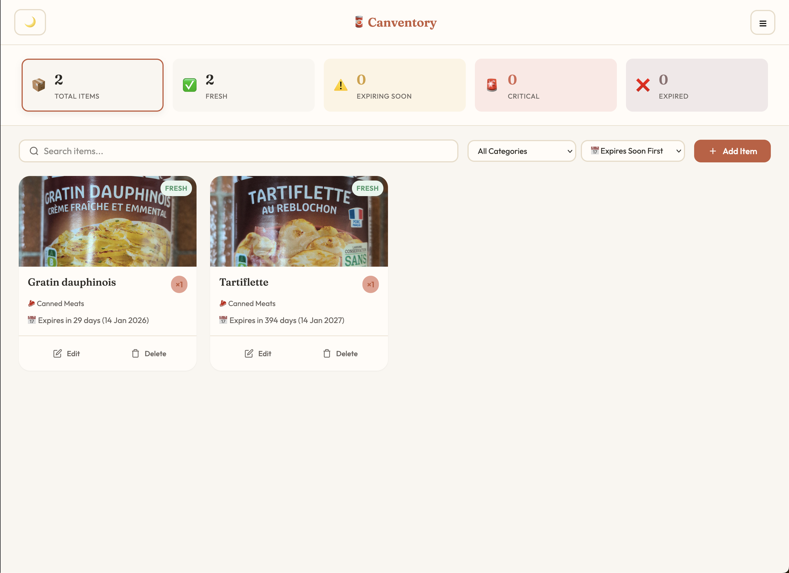
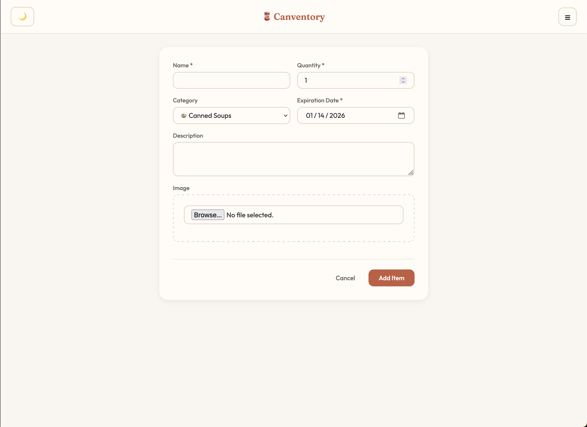

<p align="center">
  
</p>

<h1 align="center">Canventory</h1>

<p align="center">
  <strong>🥫 Stop wasting food. Start tracking smarter.</strong>
</p>

<p align="center">
  A modern, self-hosted pantry management app that tracks your cans, soups, and food items with expiration alerts - so nothing goes to waste.
</p>

<p align="center">
  <a href="#features">Features</a> •
  <a href="#screenshots">Screenshots</a> •
  <a href="#quick-start">Quick Start</a> •
  <a href="#api">API</a> •
  <a href="#configuration">Configuration</a> •
  <a href="#contributing">Contributing</a>
</p>

<p align="center">
  <a href="https://hub.docker.com/r/elthamini/canventory"></a>
  
  
  
  
</p>

---

## 🌍 Why Canventory?

> **1/3 of all food produced globally is wasted.** Much of this happens at home - forgotten cans in the back of the pantry, expired items we never knew we had.

Canventory solves this by giving you:

- 📊 **Visual dashboard** to see what's fresh, expiring, or already gone
- 🔔 **Email alerts** before items expire (never waste food again)
- 📷 **Photo tracking** to identify items at a glance
- 👥 **Multi-user support** for households and shared spaces

---

## ✨ Features

| Feature | Description |
|---------|-------------|
| 📊 **Smart Dashboard** | Visual overview with status cards - filter by Fresh, Warning, Critical, or Expired |
| 🔔 **Email Notifications** | Automated alerts for expiring items via SMTP |
| 📷 **Image Support** | Upload photos of your items for easy identification |
| 🏷️ **19 Categories** | Organized by type: canned goods, grains, snacks, beverages, and more |
| 👥 **Multi-User** | Household support with individual accounts |
| 🔐 **Admin Panel** | Manage users and settings |
| 🌓 **Dark/Light Mode** | Easy on the eyes, day or night |
| 📱 **Responsive Design** | Works on desktop, tablet, and mobile |
| 🔌 **REST API** | Full API with OpenAPI documentation |
| 🐳 **Docker Ready** | One-command deployment with Docker Compose |

---

## 📸 Screenshots

<p align="center">
  
</p>
<p align="center">
  
</p>
<p align="center">
  
</p>

---

## 🚀 Quick Start

### Option 1: Docker (Recommended)

**Pull from Docker Hub:**

```bash
docker pull elthamini/canventory:latest
```

**Or build locally with Docker Compose:**

```bash
# Clone the repository
git clone https://github.com/thamin-i/canventory.git
cd canventory

# Configure environment
cp .env.example .env
nano .env  # Edit your settings

# Build and run
docker-compose up --build

# Open in browser
open http://localhost:8000
```

### Option 2: Python Virtual Environment

**Prerequisites:** Python 3.10+, PostgreSQL 13+

```bash
# Clone and enter directory
git clone https://github.com/thamin-i/canventory.git
cd canventory

# Create virtual environment
python -m venv .venv
source .venv/bin/activate  # On Windows: .venv\Scripts\activate

# Install dependencies
pip install -r requirements.txt

# Configure environment
cp .env.example .env
nano .env  # Edit your settings

# Run the server
uvicorn app.main:APPLICATION --reload --host 0.0.0.0 --port 8000
```

---

## 🔌 API

Canventory exposes a full REST API for integration and automation.

| Endpoint | Description |
|----------|-------------|
| `GET /docs` | Interactive Swagger UI documentation |
| `GET /redoc` | ReDoc API documentation |
| `GET /openapi.json` | OpenAPI 3.0 specification |
| `GET /health` | Health check endpoint |

---

## ⚙️ Configuration

Canventory is configured via environment variables. Copy `.env.example` to `.env` and customize:

| Variable | Description | Default | Required |
|----------|-------------|---------|----------|
| `DATABASE_URL` | PostgreSQL connection string | `sqlite+aiosqlite:///./canventory.db` | ✅ |
| `SECRET_KEY` | JWT secret key | `secrets.token_urlsafe(32)` | ✅ |
| `DEBUG` | Enable debug mode | `false` | ✅ |
| `SMTP_ENABLED` | Enable email notifications | `false` | ✅ |
| `SMTP_HOST` | SMTP server hostname | `localhost` | 	❌ |
| `SMTP_PORT` | SMTP server port | `587` | 	❌ |
| `SMTP_USER` | SMTP username | - | 	❌ |
| `SMTP_PASSWORD` | SMTP password | - | 	❌ |
| `SMTP_FROM_EMAIL` | Sender email address | - | 	❌ |
| `EXPIRATION_WARNING_DAYS` | Days before expiration to warn | `7` | ✅ |
| `EXPIRATION_CRITICAL_DAYS` | Days before expiration for critical alert | `3` | ✅ |
| `CHECK_EXPIRATION_INTERVAL_HOURS` | How often to check expirations | `24` | ✅ |

---

## 🛠️ Tech Stack

- **Backend:** FastAPI, a modern Python web framework
- **Database:** PostgreSQL with SQLAlchemy ORM
- **Task Scheduling:** APScheduler for background expiration checks
- **Email:** aiosmtplib for async SMTP notifications
- **Frontend:** Jinja2 templates + vanilla JavaScript
- **Styling:** Custom CSS with CSS variables for theming
- **Deployment:** Docker & Docker Compose

---

## 🗺️ Roadmap

- [ ] 🌐 Multi-language support (i18n)
- [ ] 📱 Progressive Web App (PWA) support
- [ ] 🔍 Barcode scanning for quick item entry

Have a feature request? [Open an issue](https://github.com/thamin-i/canventory/issues)!

---

## 🤝 Contributing

Contributions are welcome! Here's how you can help:

1. **Fork** the repository
2. **Create** a feature branch (`git checkout -b feature/amazing-feature`)
3. **Commit** your changes (`git commit -m 'Add amazing feature'`)
4. **Push** to the branch (`git push origin feature/amazing-feature`)
5. **Open** a Pull Request

### Development Setup

```bash
# Install dev dependencies
pip install -r requirements-dev.txt

# Run linting
make lint

# Run tests
make test
```

---

## 📄 License

This project is licensed under the **MIT License** - see the [LICENSE](LICENSE) file for details.

---

## 💬 Support

- 🐛 **Bug reports:** [Open an issue](https://github.com/thamin-i/canventory/issues)
- 💡 **Feature requests:** [Open an issue](https://github.com/thamin-i/canventory/issues)
- ⭐ **Like it?** Give us a star on GitHub!
